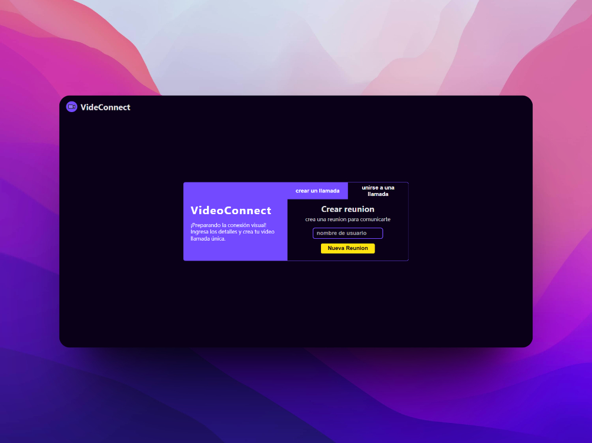

# VideoConnect

## Introducción

**VideoConnect** es un emocionante proyecto web que te permite disfrutar de videollamadas utilizando la potente API de WebRTC. La principal motivación detrás de este proyecto es doble: enriquecer mi portafolio personal y, al mismo tiempo, brindar una solución de videollamadas intuitiva y efectiva para cualquier persona.

## Tabla de Contenidos

- [Capturas de Pantalla](#screenshots)
- [Introducción](#introducción)
- [Tecnologías Utilizadas](#tech-stack)
- [Requisitos](#requisitos)
- [Instrucciones para Ejecutar Localmente](#ejecutar-localmente)
- [Demo](#demo)
- [Preguntas Frecuentes (FAQ)](#feedback)

## Tech Stack

**Client:** React, Typescript, Context, Api WebRTC, React-router-dom

**Servidor:** Nodejs, Sockets, Typescript

## Requisitos

- node >= v18
- Navegador web moderno con soporte para WebRTC.
  → [ver navegadores compatibles](https://caniuse.com/?search=webrtc)

## Ejecutar localmente

- [ejecutar frontend](./front/README.md#configuración-del-entorno)

- [ejecutar backend](./back/README.md#configuración-del-entorno)

## Demo

[ver Demo](https://dulcet-gecko-2d86af.netlify.app)

## Feedback

Si deseas proporcionarnos algún comentario o sugerencia, por favor házmelo saber [correo electrónico](mailto:camilocamilo5@outlook.com?subject=Feedback_VideoConnect).
